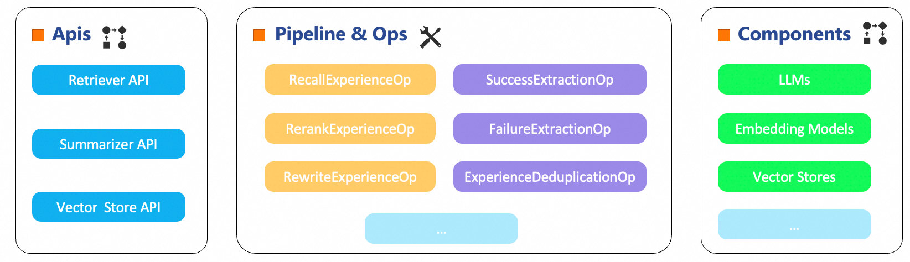

# ExperienceMaker

<p align="center">
 
</p>

<p align="center">
  <a href="https://pypi.org/project/experiencemaker/"></a>
  <a href="https://pypi.org/project/experiencemaker/"></a>
  <a href="./LICENSE"></a>
  <a href="https://github.com/modelscope/ExperienceMaker"></a>
</p>

<p align="center">
  <strong>A comprehensive framework for AI agent experience generation and reuse</strong><br>
  <em>Empowering agents to learn from the past and excel in the future</em>
</p>

---

## 📰 What's New
- **[2025-08]** 🎉 ExperienceMaker v0.1.0 is now available on [PyPI](https://pypi.org/project/experiencemaker/)!
- **[2025-07]** 📚 Complete documentation and quick start guides released
- **[2025-07]** 🚀 Multi-backend vector store support (Elasticsearch & ChromaDB)

---

## 🌟 What is ExperienceMaker?
ExperienceMaker is a framework that revolutionizes how AI agents learn and improve through **experience-driven intelligence**. 
By automatically extracting, storing, and reusing experiences from agent trajectories, it enables continuous learning and progressive skill enhancement.

### 🚀 Why ExperienceMaker?
Traditional AI agents start from scratch with every new task, wasting valuable learning opportunities. 
ExperienceMaker changes this by:
- **🧠 Learning from History**: Automatically extract actionable insights from successful and failed attempts
- **🔄 Intelligent Reuse**: Apply relevant past experiences to solve new, similar problems
- **📈 Continuous Improvement**: Build a growing knowledge base that makes agents smarter over time
- **⚡ Faster Problem Solving**: Reduce trial-and-error by leveraging proven strategies

### ✨ Core Capabilities

#### 🔍 **Intelligent Experience Summarizer**
- **Success Pattern Recognition**: Identify what works and why
- **Failure Analysis**: Learn from mistakes to avoid repetition
- **Comparative Insights**: Understand the difference between successful and failed approaches
- **Multi-step Trajectory Processing**: Break down complex tasks into learnable segments

#### 🎯 **Smart Experience Retriever**
- **Semantic Search**: Find relevant experiences using advanced embedding models
- **Context-Aware Ranking**: Prioritize the most applicable experiences for current tasks
- **Dynamic Rewriting**: Adapt past experiences to fit new contexts
- **Multi-modal Support**: Handle various input types (queries, conversations, trajectories)

#### 🗄️ **Scalable Experience Management**
- **Multiple Storage Backends**: Choose from Elasticsearch (production), ChromaDB (development), or file-based (testing)
- **Workspace Isolation**: Organize experiences by projects, domains, or teams
- **Deduplication & Validation**: Ensure high-quality, unique experience storage
- **Batch Operations**: Efficiently handle large-scale experience processing

#### 🔧 **Developer-Friendly Architecture**
- **REST API Interface**: Easy integration with existing systems
- **Modular Pipeline Design**: Compose custom workflows from atomic operations
- **Flexible Configuration**: YAML files and command-line overrides

### 🏗️ Framework Architecture
<p align="center">
 
</p>

ExperienceMaker follows a modular, scalable architecture designed for production use:
#### 🌐 **API Layer**
- **🔍 Retriever API**: Query-based and conversation-based experience retrieval
- **📊 Summarizer API**: Trajectory-to-experience conversion and storage  
- **🗄️ Vector Store API**: Database management and workspace operations
- **🤖 Agent API**: ReAct-based agent execution with experience enhancement
#### ⚙️ **Processing Pipeline**
Our atomic operations can be composed into powerful pipelines:
**Retrieval Pipeline**:
```
build_query_op->recall_vector_store_op->merge_experience_op
```
**Summarization Pipeline**:
```
simple_summary_op->update_vector_store_op
```

#### 🔌 **Extensible Components**
- **LLM Integration**: OpenAI-compatible APIs with flexible model switching
- **Embedding Models**: Pluggable embedding providers for semantic search
- **Vector Stores**: Multiple backends for different deployment scenarios
- **Tools & Operators**: Extensible library of processing operations

---

## 🛠️ Installation

### Option 1: Install from PyPI (Recommended)

```bash
pip install experiencemaker
```

### Option 2: Install from Source

```bash
git clone https://github.com/modelscope/ExperienceMaker.git
cd ExperienceMaker
pip install .
```

## ⚙️ Environment Setup

Create a `.env` file in your project directory:

```bash
# Required: LLM API configuration
LLM_API_KEY="sk-xxx"
LLM_BASE_URL="https://xxx.com/v1"

# Required: Embedding model configuration  
EMBEDDING_MODEL_API_KEY="sk-xxx"
EMBEDDING_MODEL_BASE_URL="https://xxx.com/v1"

# Optional: Elasticsearch configuration (if using Elasticsearch backend)

```

## 🚀 Start the Service

For testing, use the `local_file` backend:
```bash
experiencemaker \
  llm.default.model_name=qwen3-32b \
  embedding_model.default.model_name=text-embedding-v4 \
  vector_store.default.backend=local_file
```
Refer to [Advanced Guide](./doc/advanced_guide.md) for more details.
This guide covers advanced configuration topics including custom pipelines, operation parameters, and configuration methods.

The service will start on `http://localhost:8001`

### Elasticsearch Backend
```bash
experiencemaker \
  llm.default.model_name=qwen3-32b \
  embedding_model.default.model_name=text-embedding-v4 \
  vector_store.default.backend=elasticsearch
```

**Setup Elasticsearch:**
```bash
export ES_HOSTS="http://localhost:9200"
# Quick setup using Elastic's official script
curl -fsSL https://elastic.co/start-local | sh
```
Refer to [Vector Store Setup](./doc/vector_store_setup.md) for more details.

## 📝 Your First ExperienceMaker Script
Here, load_dotenv is used to load environment variables from the .env file, or you can manually export them to the environment. 
`base_url` is the address of the ExperienceMaker service mentioned above, and workspace_id is the name of the current workspace for storing experiences. 
Experiences in different workspace_ids are not shared or accessible across workspaces.

### Call Summarizer Examples
```python
import requests
from dotenv import load_dotenv

load_dotenv()
base_url = "http://0.0.0.0:8001/"
workspace_id = "test_workspace"


def run_summary(messages: list):
    response = requests.post(url=base_url + "summarizer", json={
        "workspace_id": workspace_id,
        "traj_list": [
            {"messages": messages, "score": 1.0}
        ]
    })

    response = response.json()
    experience_list = response["experience_list"]
    for experience in experience_list:
        print(experience)
```

### Call Retriever Examples

```python
import requests
from dotenv import load_dotenv

load_dotenv()
base_url = "http://0.0.0.0:8001/"
workspace_id = "test_workspace"


def run_retriever(query: str):
    response = requests.post(url=base_url + "retriever", json={
        "workspace_id": workspace_id,
        "query": query,
    })

    response = response.json()
    experience_merged: str = response["experience_merged"]
    print(f"experience_merged={experience_merged}")
```

### Dump Experiences From Vector Store

```python
import requests
from dotenv import load_dotenv

load_dotenv()
base_url = "http://0.0.0.0:8001/"
workspace_id = "test_workspace1"


def dump_experience():
    response = requests.post(url=base_url + "vector_store", json={
        "workspace_id": workspace_id,
        "action": "dump",
        "path": "./",
    })
    print(response.json())
```

### Load Experiences To Vector Store

```python
import requests
from dotenv import load_dotenv

load_dotenv()
base_url = "http://0.0.0.0:8001/"
workspace_id = "test_workspace1"


def load_experience():
    response = requests.post(url=base_url + "vector_store", json={
        "workspace_id": "test_workspace1",
        "action": "load",
        "path": "./",
    })

    print(response.json())
```

Here, we have prepared a [simple react agent](./cookbook/simple_demo/simple_demo.py) to demonstrate how to enhance its
capabilities by integrating a summarizer and a retriever, thereby achieving better performance.
---

## Experiment

### Experiment on Appworld

TODO

### Experiment on BFCL-V3

TODO

---

## Future RoadMap

TODO


---

## Ready-made Experience Store

TODO

---

## 📚 Additional Resources

- **[Vector Store Setup](./doc/vector_store_setup.md)**: Production deployment guide
- **[Configuration Guide](./doc/configuration_guide.md)**: Advanced configuration options
- **[Advanced Guide](./doc/advanced_guide.md)**: custom pipelines, operation parameters, and configuration methods.
- **[Operations Documentation](./doc/operations_documentation.md)**: Advanced operations configuration
- **[Example Collection](./cookbook)**: More practical examples
- **[Future RoadMap](./doc/future_roadmap.md)**: Our future plans

---

## 🤝 Contributing
We welcome contributions from the community! Here's how you can help:

### 🐛 **Report Issues**
- Bug reports and feature requests
- Documentation improvements
- Performance optimization suggestions

### 💻 **Code Contributions**
- New operations and tools
- Backend implementations
- API enhancements
- Test coverage improvements

### 📝 **Documentation**
- Usage examples and tutorials
- Best practices and patterns
- Translation and localization

**Getting Started**: Fork the repository, create a feature branch, and submit a pull request. Please follow our coding standards and include tests for new functionality.

---
## 📄 Citation
If you use ExperienceMaker in your research or projects, please cite:
```bibtex
@software{ExperienceMaker,
  title = {ExperienceMaker: A Comprehensive Framework for AI Agent Experience Generation and Reuse},
  author = {The ExperienceMaker Team},
  url = {https://github.com/modelscope/ExperienceMaker},
  month = {08},
  year = {2025},
}
```

---
## ⚖️ License

This project is licensed under the Apache License 2.0 - see the [LICENSE](./LICENSE) file for details.
---