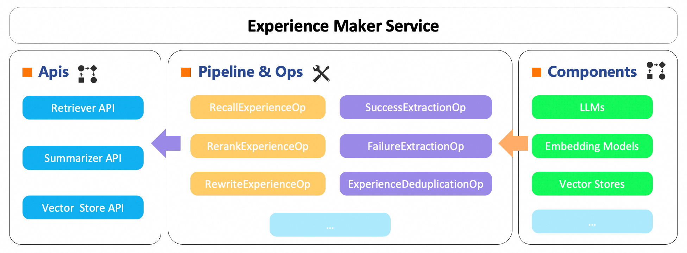

# ExperienceMaker

<p align="center">
 
</p>

<p align="center">
  <a href="https://pypi.org/project/experiencemaker/"></a>
  <a href="https://pypi.org/project/experiencemaker/"></a>
  <a href="./LICENSE"></a>
  <a href="https://github.com/modelscope/ExperienceMaker"></a>
</p>

<p align="center">
  <strong>A comprehensive framework for AI agent experience generation and reuse</strong><br>
  <em>Empowering agents to learn from the past and excel in the future</em>
</p>
---

## 📰 What's New
- **[2025-08]** 🎉 ExperienceMaker v0.1.0 is now available on [PyPI](https://pypi.org/project/experiencemaker/)!
- **[2025-07]** 📚 Complete documentation and quick start guides released
- **[2025-07]** 🚀 Multi-backend vector store support (Elasticsearch & ChromaDB)
---

## 📰 What's Next
- **Pre-built Experience Libraries**: Domain repositories (Finance/Coding/Education/Research) + community marketplace
- **Rich Experience Formats**: Executable code/tool configs/pipeline templates/workflows
- **Experience Validation**: Quality analysis + cross-task effectiveness + auto-refinement
- **Universal Trajectory Extraction**: Raw logs/multimodal data/execution traces → experiences

Exciting features and improvements are on the horizon! Check out our detailed [Future Roadmap](./doc/future_roadmap.md) for upcoming enhancements.

---

## 🌟 What is ExperienceMaker?
ExperienceMaker is a framework that transforms how AI agents learn and improve through **experience-driven intelligence**. 
By automatically extracting, storing, and intelligently reusing experiences from agent trajectories, it enables continuous learning and progressive skill enhancement.

### 💡 Why ExperienceMaker?
Traditional AI agents start from scratch with every new task, wasting valuable learning opportunities. 
ExperienceMaker changes this paradigm by:
- **🧠 Learning from History**: Automatically extract actionable insights from both successful and failed attempts
- **🔄 Intelligent Reuse**: Apply relevant past experiences to solve new, similar challenges more effectively
- **📈 Continuous Improvement**: Build a growing knowledge base that makes agents progressively smarter

### ✨ Core Capabilities

#### 🔍 **Intelligent Experience Summarizer**
- **Success Pattern Recognition**: Identify what works and understand the underlying principles
- **Failure Analysis**: Learn from mistakes to avoid repeating them in future tasks
- **Comparative Insights**: Understand the critical differences between successful and failed approaches
- **Multi-step Trajectory Processing**: Break down complex tasks into learnable, actionable segments

#### 🎯 **Smart Experience Retriever**
- **Semantic Search**: Find relevant experiences using advanced embedding models and semantic understanding
- **Context-Aware Ranking**: Prioritize the most applicable experiences for current task contexts
- **Dynamic Rewriting**: Intelligently adapt past experiences to fit new situations and requirements
- **Multi-modal Support**: Handle various input types including query, messages

#### 🗄️ **Scalable Experience Management**
- **Multiple Storage Backends**: Choose from Elasticsearch (production-ready), ChromaDB (development), or file-based storage (testing)
- **Workspace Isolation**: Organize experiences by projects, domains, or teams with complete separation
- **Deduplication & Validation**: Ensure high-quality, unique experience storage with automated quality control
- **Batch Operations**: Efficiently handle large-scale experience processing with optimized performance

#### 🔧 **Developer-Friendly Architecture**
- **REST API Interface**: Seamless integration with existing systems through clean API design
- **Modular Pipeline Design**: Compose custom workflows from atomic operations with maximum flexibility
- **Flexible Configuration**: YAML files and command-line overrides for easy customization
- **Experience Store**: Ready-to-use out of the box — there’s no need for you to manually summarize experiences. You can directly leverage existing, comprehensive experience datasets to greatly enhance your agent’s capabilities.

### 🏗️ Framework Architecture
<p align="center">
 
</p>

ExperienceMaker follows a modular, production-ready architecture designed for scalability:
#### ⚙️ **API Layer**
- **🔍 Retriever API**: Query-based and conversation-based experience retrieval with intelligent matching
- **📊 Summarizer API**: Trajectory-to-experience conversion and automated storage management
- **🗄️ Vector Store API**: Database management and workspace operations with full CRUD support

#### ⚙️ **Processing Pipeline**
Our atomic operations can be seamlessly composed into powerful processing pipelines: custom1_op->custom2_op...

#### 🔌 **Extensible Components**
- **LLM Integration**: OpenAI-compatible APIs with flexible model switching and provider support
- **Embedding Models**: Pluggable embedding providers for sophisticated semantic search capabilities
- **Vector Stores**: Multiple backends optimized for different deployment scenarios and scales
- **Tools & Operators**: Comprehensive, extensible library of processing operations

---

## 🛠️ Installation

### Option 1: Install from PyPI (Recommended)

```bash
pip install experiencemaker
```

### Option 2: Install from Source

```bash
git clone https://github.com/modelscope/ExperienceMaker.git
cd ExperienceMaker
pip install .
```

## ⚙️ Environment Setup

Create a `.env` file in your project directory:

```bash
# Required: LLM API configuration
LLM_API_KEY="sk-xxx"
LLM_BASE_URL="https://xxx.com/v1"

# Required: Embedding model configuration  
EMBEDDING_MODEL_API_KEY="sk-xxx"
EMBEDDING_MODEL_BASE_URL="https://xxx.com/v1"

# Optional: Elasticsearch configuration (if using Elasticsearch backend)

```

## 🚀 Quick Start

For testing and development, use the `local_file` backend:
```bash
experiencemaker \
  http_service.port=8001 \
  llm.default.model_name=qwen3-32b \
  embedding_model.default.model_name=text-embedding-v4 \
  vector_store.default.backend=local_file
```
💡 **Pro Tip**: Check out our [Advanced Guide](./doc/advanced_guide.md) for detailed configuration topics including custom pipelines, operation parameters, and advanced configuration methods.

The service will start on `http://localhost:8001`

### 🔍 Production Setup with Elasticsearch Backend
```bash
experiencemaker \
  llm.default.model_name=qwen3-32b \
  embedding_model.default.model_name=text-embedding-v4 \
  vector_store.default.backend=elasticsearch
```

**Setup Elasticsearch:**
```bash
export ES_HOSTS="http://localhost:9200"
# Quick setup using Elastic's official script
curl -fsSL https://elastic.co/start-local | sh
```
📖 **Need Help?** Refer to [Vector Store Setup](./doc/vector_store_setup.md) for comprehensive deployment guidance.

## 📝 Your First ExperienceMaker Script

Here's how to get started!
- The `load_dotenv()` function loads environment variables from your `.env` file, or you can manually export them.
- The `base_url` points to your ExperienceMaker service.
- The `workspace_id` serves as your experience storage namespace. Experiences in different workspaces remain completely
  isolated and cannot access each other.

```python
import requests
from dotenv import load_dotenv

load_dotenv()
base_url = "http://0.0.0.0:8001/"
workspace_id = "test_workspace"
```

### 📊 Call Summarizer Examples
Batch summarize the trajectory list, where each trajectory consists of a message and a score. 
- The message is the conversation history.
- The score represents the rating between 0 and 1, with 0 typically indicating failure and 1 indicating success.

```python
response = requests.post(url=base_url + "summarizer", json={
  "workspace_id": workspace_id,
  "traj_list": [
    {"messages": messages, "score": 1.0}
  ]
})

response = response.json()
experience_list = response["experience_list"]
for experience in experience_list:
  print(experience)
```

### 🔍 Call Retriever Examples
Retrieve the top_k={top_k} experiences related to {query} in workspace=test_workspace, and finally accept the assembled context. 
Alternatively, you can also accept the raw experience_list parameter and assemble the context yourself.

```python
response = requests.post(url=base_url + "retriever", json={
  "workspace_id": workspace_id,
  "query": query,
  "top_k": 1,
})

response = response.json()
experience_merged: str = response["experience_merged"]
print(f"experience_merged={experience_merged}")
```

### 💾 Dump Experiences From Vector Store
Dump the experience with workspace_id from the vector store into the {path}/{workspace_id}.jsonl file.

```python
response = requests.post(url=base_url + "vector_store", json={
  "workspace_id": workspace_id,
  "action": "dump",
  "path": "./",
})
print(response.json())
```

### 📥 Load Experiences To Vector Store
Load the {path}/{workspace_id}.jsonl file into the vector store, workspace_id={workspace_id}.

```python
response = requests.post(url=base_url + "vector_store", json={
  "workspace_id": workspace_id,
  "action": "load",
  "path": "./",
})

print(response.json())
```

🎭 **Want to See It in Action?** We've prepared a [simple react agent](./cookbook/simple_demo/simple_demo.py) that demonstrates how to enhance agent capabilities by integrating summarizer and retriever components, achieving significantly better performance.

---

## 🧪 Experiments

### 🌍 Experiment on Appworld

# Qwen3-8B Experimental Results

We test ExperienceMaker on Appworld with qwen3-8b:

| Method                                   | best@1     | best@2       | best@4     |
|------------------------------------------|------------|--------------|------------|
| w/o ExperienceMaker (baseline)           | 0.3561     | 0.4052       | 0.4536     |
| **w ExperienceMaker**                    |            |              |            |
| [1] extract + compare + recall           | **0.4069** | 	**0.5066**	 | 0.618      |
| [2] extract + compare + recall + rewrite | 0.3910     | 0.5038       | **0.6211** |

### 🔧 Experiment on BFCL-V3

Coming Soon! Stay tuned for comprehensive evaluation results.

---

## 🏪 Ready-made Experience Store

Pre-built experience collections for common domains and use cases are coming soon. This will include ready-to-use experiences for web automation, data processing, API interactions, and more.

---

## 📚 Additional Resources

- **[Vector Store Setup](./doc/vector_store_setup.md)**: Complete production deployment guide
- **[Configuration Guide](./doc/configuration_guide.md)**: Describes all available command-line parameters for ExperienceMaker Service
- **[Advanced Guide](./doc/advanced_guide.md)**: Custom pipelines, operation parameters, and advanced configuration methods
- **[Operations Documentation](./doc/operations_documentation.md)**: Comprehensive operations configuration reference
- **[Example Collection](./cookbook)**: Practical examples and use cases
- **[Future RoadMap](./doc/future_roadmap.md)**: Our vision and upcoming features

---

## 🤝 Contributing
We warmly welcome contributions from the community! Here's how you can help make ExperienceMaker even better:

### 🐛 **Report Issues**
- Bug reports with detailed reproduction steps
- Feature requests and enhancement suggestions
- Documentation improvements and clarifications
- Performance optimization ideas

### 💻 **Code Contributions**
- New operations and tools development
- Backend implementations and optimizations
- API enhancements and new endpoints
- Test coverage improvements and quality assurance

### 📝 **Documentation**
- Usage examples and comprehensive tutorials
- Best practices guides and design patterns
- Translation and localization efforts

---
## 📄 Citation
If you use ExperienceMaker in your research or projects, please cite:
```bibtex
@software{ExperienceMaker,
  title = {ExperienceMaker: A Comprehensive Framework for AI Agent Experience Generation and Reuse},
  author = {The ExperienceMaker Team},
  url = {https://github.com/modelscope/ExperienceMaker},
  month = {08},
  year = {2025},
}
```

---
## ⚖️ License
This project is licensed under the Apache License 2.0 - see the [LICENSE](./LICENSE) file for details.

---