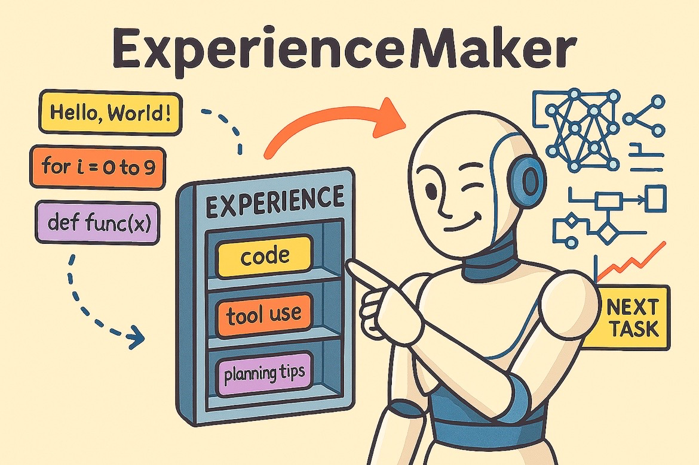

# ExperienceMaker

<p align="center">
 
</p>

[](https://pypi.org/project/experiencemaker/)
[](https://pypi.org/project/experiencemaker/)
[](./LICENSE)

----

## 📰 News

- **[2025-01]** We release ExperienceMaker v0.1.0 now, which is also available in [PyPI](https://pypi.org/simple/experiencemaker/)!

----

## 🌟 What is ExperienceMaker?

ExperienceMaker is a comprehensive framework that provides AI agents with robust capabilities for **experience generation and reuse**. By summarizing agents' past trajectories into structured experiences, it enables these experiences to be intelligently applied to subsequent tasks. Through the continuous accumulation and application of experience, agents can keep learning and progressively become more skilled in performing complex tasks.

### 🚀 Core Features

- **🧠 Experience Generation**: Automatically generate successful or failed experiences by summarizing the agent's historical trajectories using advanced LLM-powered extraction techniques.

- **🔄 Experience Reuse**: Intelligently apply relevant experiences to new tasks by retrieving them from a vector store, helping agents improve through practice and reduce trial-and-error.

- **📊 Experience Management**: Comprehensive management of experiences with operations including loading, dumping, clearing historical experiences, deduplication, validation, and flexible database operations.

- **🔍 Multi-Modal Retrieval**: Support both query-based and conversation-based experience retrieval with advanced reranking and rewriting capabilities.

### ⚡ Core Advantages

- **🎯 Ease of Use**: HTTP REST API interface with one-click startup via command line. Configuration can be quickly updated using YAML files and command-line arguments.

- **🔧 Flexibility**: Rich library of atomic operations that can be composed into pipelines. Users can flexibly implement any summarization or retrieval workflow by combining operators.

- **🗄️ Multiple Vector Store Backends**: Support for Elasticsearch (production), ChromaDB (local development), and file-based storage (testing) to fit different deployment scenarios.

- **📚 Experience Store**: Ready-to-use out of the box — leverage existing, comprehensive experience datasets to enhance your agent's capabilities without manual experience creation.

- **⚙️ Modular Architecture**: Pluggable components for LLMs, embedding models, vector stores, and operators, making it easy to customize and extend.

### 🏗️ Framework Architecture

<p align="center">
 
</p>

ExperienceMaker follows a modular architecture with the following key components:

#### 🌐 API Layer
- **Retriever API**: Interface for experience retrieval. Input can be a query or conversation messages, output includes retrieved experiences and merged contextual content.
- **Summarizer API**: Interface for experience summarization. Input is agent's historical trajectories, output is structured experiences stored in vector store.
- **Vector Store API**: Interface for experience database management with operations like dump/load, create/delete workspaces, and batch operations.
- **Agent API**: Interface for running agents with experience-enhanced prompts using ReAct framework.

#### 🔄 Pipeline & Operators
ExperienceMaker abstracts experience capabilities into atomic operators that can be composed into flexible pipelines:

- **Retrieval Operators**: Query building, experience recall, reranking, rewriting
- **Summarization Operators**: Success/failure extraction, comparative analysis, validation, deduplication
- **Vector Store Operators**: CRUD operations, workspace management, batch processing

#### 🗃️ Vector Store Backends
- **Elasticsearch**: Production-ready, high-performance, supports complex filtering
- **ChromaDB**: Local development, embedded database, good for prototyping
- **File Store**: Simple file-based storage for testing and small datasets

#### 🤖 LLM & Embedding Integration
- **OpenAI-Compatible LLMs**: Support for any OpenAI-compatible API endpoint
- **Embedding Models**: Configurable embedding models for semantic search
- **Model Registry**: Pluggable architecture for easy model switching

---

## 🛠️ Installation

### Install from Source

```shell
git clone https://github.com/modelscope/ExperienceMaker.git
cd ExperienceMaker

# Install the package
pip install .
```

### Install from PyPI

```shell
pip install experiencemaker
```

---

## ⚡ Quick Start

### 1. Environment Setup

First, configure the required environment variables for LLM and embedding model services:

```shell
# Required: LLM API configuration
export LLM_API_KEY="sk-xxx"
export LLM_BASE_URL="https://api.openai.com/v1"

# Required: Embedding model configuration  
export EMBEDDING_MODEL_API_KEY="sk-xxx"
export EMBEDDING_MODEL_BASE_URL="https://api.openai.com/v1"

# Optional: Elasticsearch configuration (if using Elasticsearch backend)
export ES_HOSTS="http://localhost:9200"
```

### 2. Start ExperienceMaker Service

Start the service with a single command:

```shell
experiencemaker \
  llm.default.model_name=gpt-4 \
  embedding_model.default.model_name=text-embedding-3-small \
  vector_store.default.backend=elasticsearch
```

**Backend Options:**
- `elasticsearch` - Production deployment (recommended)
- `chroma` - Local development and medium scale
- `local_file` - Testing and small datasets

### 3. Vector Store Setup (Optional)

#### For Production (Elasticsearch)

ExperienceMaker uses Elasticsearch as the default vector store for production environments. To set up Elasticsearch locally:

```shell
# Quick setup using Elastic's official script
curl -fsSL https://elastic.co/start-local | sh
```

For detailed setup instructions, see our [Vector Store Guide](./cookbook/material/vector_store_quick_start.md).

#### For Development (ChromaDB or File Store)

For quick testing, you can use the file-based backend:

```shell
experiencemaker vector_store.default.backend=local_file
```

---

## 📚 API Usage

### Experience Summarization

Convert agent trajectories into structured experiences:

```python
import json
import requests

base_url = "http://localhost:8001"
workspace_id = "my_workspace"

def summarize_experience(messages: list, score: float = 1.0):
    """Summarize agent trajectory into experiences"""
    response = requests.post(
        url=f"{base_url}/summarizer",
        json={
            "workspace_id": workspace_id,
            "traj_list": [
                {"messages": messages, "score": score}
            ]
        }
    )
    
    if response.status_code == 200:
        result = response.json()
        print(f"Generated {len(result['experience_list'])} experiences")
        return result["experience_list"]
    else:
        print(f"Error: {response.text}")
        return []
```

### Experience Retrieval

Retrieve relevant experiences for new tasks:

```python
def retrieve_experience(query: str, top_k: int = 5):
    """Retrieve relevant experiences for a query"""
    response = requests.post(
        url=f"{base_url}/retriever", 
        json={
            "workspace_id": workspace_id,
            "query": query,
            "top_k": top_k
        }
    )
    
    if response.status_code == 200:
        result = response.json()
        return {
            "experiences": result["experience_list"],
            "merged_context": result["experience_merged"]
        }
    else:
        print(f"Error: {response.text}")
        return {}
```

### Vector Store Management

Manage experience databases:

```python
def manage_vector_store(action: str, **params):
    """Manage vector store operations"""
    response = requests.post(
        url=f"{base_url}/vector_store",
        json={
            "workspace_id": workspace_id,
            "action": action,
            **params
        }
    )
    
    return response.json() if response.status_code == 200 else None

# Examples:
# Create workspace
manage_vector_store("create")

# Dump experiences to file
manage_vector_store("dump", path="./backup/experiences.jsonl")

# Load experiences from file  
manage_vector_store("load", path="./backup/experiences.jsonl")
```

---

## 🎯 Complete Example

Here's a comprehensive example showing the full experience lifecycle:

```python
import json
import requests
from typing import List, Dict

class ExperienceMakerClient:
    def __init__(self, base_url: str = "http://localhost:8001"):
        self.base_url = base_url
    
    def run_agent_with_experience(self, query: str, workspace_id: str) -> Dict:
        """Run agent with experience enhancement"""
        
        # Step 1: Retrieve relevant experiences
        print("🔍 Retrieving relevant experiences...")
        experience_response = requests.post(
            url=f"{self.base_url}/retriever",
            json={"workspace_id": workspace_id, "query": query}
        )
        
        experience_context = ""
        if experience_response.status_code == 200:
            experience_context = experience_response.json()["experience_merged"]
        
        # Step 2: Run agent with enhanced prompt
        print("🤖 Running agent with experience context...")
        enhanced_query = f"""
Previous Experience Context:
{experience_context}

Current Task:
{query}
"""
        
        agent_response = requests.post(
            url=f"{self.base_url}/agent",
            json={"query": enhanced_query}
        )
        
        if agent_response.status_code == 200:
            agent_result = agent_response.json()
            
            # Step 3: Summarize new experience
            print("📝 Summarizing new experience...")
            summary_response = requests.post(
                url=f"{self.base_url}/summarizer",
                json={
                    "workspace_id": workspace_id,
                    "traj_list": [
                        {"messages": agent_result["messages"], "score": 1.0}
                    ]
                }
            )
            
            return {
                "answer": agent_result["answer"],
                "messages": agent_result["messages"],
                "new_experiences": summary_response.json()["experience_list"] if summary_response.status_code == 200 else []
            }
        
        return {"error": "Failed to run agent"}

# Usage example
if __name__ == "__main__":
    client = ExperienceMakerClient()
    
    # Example queries
    queries = [
        "Analyze Tesla's financial performance",
        "Create a market analysis report for Apple Inc.",
        "Research renewable energy trends in 2024"
    ]
    
    workspace_id = "financial_analysis"
    
    for query in queries:
        print(f"\n{'='*50}")
        print(f"Query: {query}")
        print(f"{'='*50}")
        
        result = client.run_agent_with_experience(query, workspace_id)
        
        if "answer" in result:
            print(f"Answer: {result['answer'][:200]}...")
            print(f"Generated {len(result['new_experiences'])} new experiences")
        else:
            print(f"Error: {result.get('error', 'Unknown error')}")
```

For more examples and advanced usage, see the [cookbook](./cookbook/) directory.

---

## 🔧 Configuration

ExperienceMaker supports flexible configuration through YAML files and command-line arguments:

### YAML Configuration

```yaml
# config.yaml
http_service:
  host: "0.0.0.0"
  port: 8001

api:
  retriever: recall_experience_op->rerank_experience_op->rewrite_experience_op
  summarizer: success_extraction_op->experience_validation_op->experience_storage_op

llm:
  default:
    backend: openai_compatible
    model_name: gpt-4
    params:
      temperature: 0.7

embedding_model:
  default:
    backend: openai_compatible  
    model_name: text-embedding-3-small

vector_store:
  default:
    backend: elasticsearch
    embedding_model: default
```

### Command Line Override

```shell
experiencemaker \
  --config config.yaml \
  llm.default.model_name=gpt-4-turbo \
  vector_store.default.backend=chroma \
  http_service.port=8002
```

---

## 📖 Documentation

- **[Quick Start Guide](./cookbook/react/quick_start.md)** - Get started with ExperienceMaker
- **[Vector Store Guide](./cookbook/material/vector_store_quick_start.md)** - Comprehensive vector store setup
- **[API Documentation](./cookbook/)** - Detailed API reference
- **[Configuration Reference](./cookbook/)** - All configuration options
- **[Examples](./cookbook/simple_demo/)** - Working code examples

---

## 🤝 Contributing

We welcome contributions! Please see our contributing guidelines for more information.

---

## 📄 Citation

If you use ExperienceMaker in your research, please cite:

```bibtex
@software{ExperienceMaker,
  title = {ExperienceMaker},
  author = {The ExperienceMaker Team},
  url = {https://github.com/modelscope/ExperienceMaker},
  month = {01},
  year = {2025}
}
```

---

## ⚖️ License

This project is licensed under the Apache 2.0 License - see the [LICENSE](./LICENSE) file for details.

---

<p align="center">
Made with ❤️ by the ExperienceMaker Team
</p>
