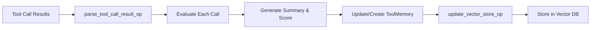
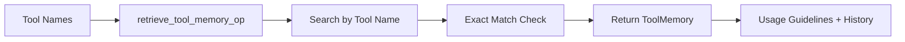
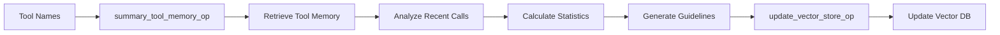
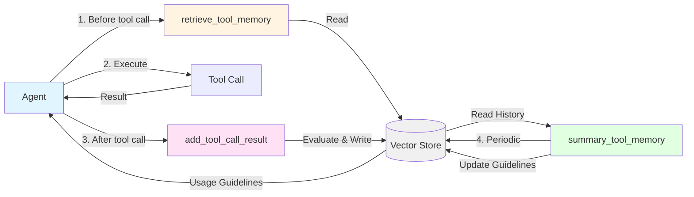
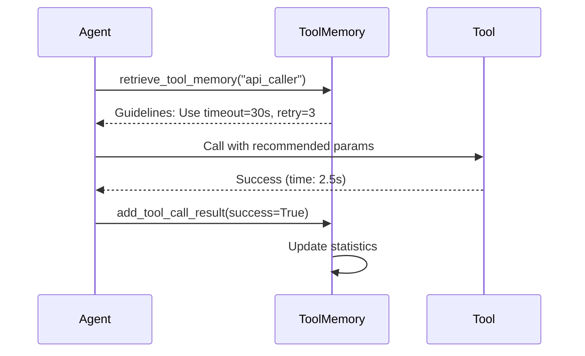
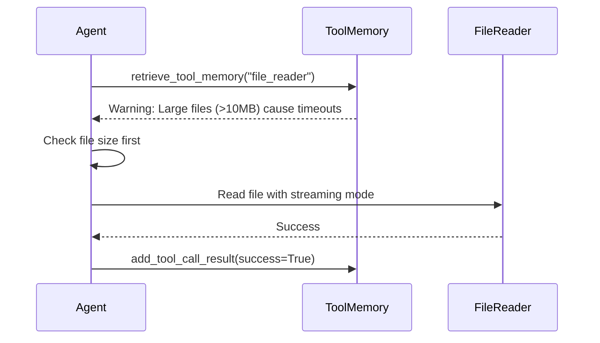
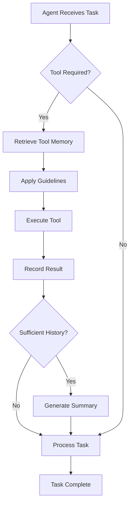

# Tool Memory in ReMe

Tool Memory is a specialized component of ReMe that captures and learns from tool usage patterns, enabling AI agents to improve their tool invocation strategies over time. This document explains how tool memory works and how to use it in your applications.

## What is Tool Memory?

Tool Memory represents knowledge extracted from historical tool invocations, including:
- Usage patterns and best practices for specific tools
- Common parameter configurations that lead to success or failure
- Performance characteristics (time cost, token cost, success rate)
- Actionable recommendations based on real usage data

Each tool memory contains:
- `when_to_use`: The tool name (used as the unique identifier)
- `content`: Synthesized usage guidelines and best practices
- `tool_call_results`: Historical invocation records with evaluations
- Statistical metrics about tool performance

## Tool Memory Data Structure

### ToolMemory

```python
class ToolMemory(BaseMemory):
    memory_type: str = "tool"
    workspace_id: str                    # Workspace identifier
    memory_id: str                       # Unique memory ID
    when_to_use: str                     # Tool name (serves as identifier)
    content: str                         # Synthesized usage guidelines
    score: float                         # Overall quality score
    time_created: str                    # Creation timestamp
    time_modified: str                   # Last modification timestamp
    author: str                          # Creator (typically LLM model name)
    tool_call_results: List[ToolCallResult]  # Historical invocation records
    metadata: dict                       # Additional metadata
```

### ToolCallResult

```python
class ToolCallResult(BaseModel):
    create_time: str        # Invocation timestamp
    tool_name: str          # Name of the tool
    input: dict | str       # Input parameters
    output: str             # Tool output
    token_cost: int         # Token consumption
    success: bool           # Whether invocation succeeded
    time_cost: float        # Time consumed (seconds)
    summary: str            # Brief summary of the result
    evaluation: str         # Detailed evaluation
    score: float            # Evaluation score (0.0, 0.5, or 1.0)
    metadata: dict          # Additional metadata
```

Tool Memory learns from each tool invocation by evaluating the result and accumulating insights over time.

## Configuration Logic

Tool Memory in ReMe is configured through three main flows:

### 1. Add Tool Call Result

The `add_tool_call_result` flow processes individual tool invocations and adds them to memory:

```yaml
add_tool_call_result:
  flow_content: parse_tool_call_result_op >> update_vector_store_op
  description: "Evaluates and adds tool call results to the tool memory database"
```



This flow:
1. Receives tool call results with input, output, and metadata
2. Evaluates each call using LLM (generates summary, evaluation, score)
3. Appends evaluated results to the tool's memory
4. Updates the vector store with the modified memory

### 2. Retrieve Tool Memory

The `retrieve_tool_memory` flow fetches usage guidelines for specific tools:

```yaml
retrieve_tool_memory:
  flow_content: retrieve_tool_memory_op
  description: "Retrieves tool memories from the vector database based on tool names"
```



This flow:
1. Takes comma-separated tool names as input
2. Searches the vector store for exact matches
3. Returns tool memories with usage guidelines and call history

### 3. Summary Tool Memory

The `summary_tool_memory` flow analyzes historical data and generates comprehensive usage guidelines:

```yaml
summary_tool_memory:
  flow_content: summary_tool_memory_op >> update_vector_store_op
  description: "Analyzes tool call history and generates comprehensive usage patterns"
```



This flow:
1. Retrieves existing tool memories by tool name
2. Analyzes recent N tool calls (default: 20)
3. Calculates statistical metrics (success rate, avg score, costs)
4. Uses LLM to synthesize actionable usage guidelines
5. Updates the tool memory content with new insights

## Complete Interaction Flow

The following diagram illustrates how the three operations interact with the vector store and agent tool calls:



### Workflow Steps

**1. retrieve_tool_memory** (Before tool execution)
- Agent queries usage guidelines from Vector Store
- Returns best practices and historical patterns

**2. Tool Call Execution**
- Agent executes tool with recommended parameters
- Gets result (success/failure, output, costs)

**3. add_tool_call_result** (After tool execution)
- Evaluates the tool call result
- Stores evaluated result to Vector Store

**4. summary_tool_memory** (Periodic)
- Analyzes accumulated call history
- Generates comprehensive usage guidelines
- Updates Vector Store with new insights

## Basic Usage

Here's how to use Tool Memory in your application:

### Step 1: Set Up Your Environment

```python
import requests

# API configuration
BASE_URL = "http://0.0.0.0:8002/"
WORKSPACE_ID = "your_workspace_id"
```

### Step 2: Record Tool Call Results

After your agent executes a tool, record the invocation:

```python
# Example: Record a web search tool call
tool_call_results = [
    {
        "create_time": "2025-10-15 14:30:00",
        "tool_name": "web_search",
        "input": {
            "query": "Python asyncio tutorial",
            "max_results": 10,
            "language": "en"
        },
        "output": "Found 10 relevant results including official docs and tutorials",
        "token_cost": 150,
        "success": True,
        "time_cost": 2.3
    }
]

# Add the tool call result
response = requests.post(
    url=f"{BASE_URL}add_tool_call_result",
    json={
        "workspace_id": WORKSPACE_ID,
        "tool_name": "web_search",
        "tool_call_results": tool_call_results
    }
)
```

### Step 3: Retrieve Tool Usage Guidelines

Before using a tool, retrieve its usage guidelines:

```python
# Retrieve memory for specific tools
response = requests.post(
    url=f"{BASE_URL}retrieve_tool_memory",
    json={
        "workspace_id": WORKSPACE_ID,
        "tool_names": "web_search,file_reader"  # Comma-separated
    }
)

memory_list = response.json().get("metadata", {}).get("memory_list", [])
for memory in memory_list:
    print(f"Tool: {memory['when_to_use']}")
    print(f"Guidelines: {memory['content']}")
    print(f"Total Calls: {len(memory['tool_call_results'])}")
```

### Step 4: Generate Comprehensive Usage Guidelines

After accumulating sufficient call history, generate synthesized guidelines:

```python
# Summarize tool usage patterns
response = requests.post(
    url=f"{BASE_URL}summary_tool_memory",
    json={
        "workspace_id": WORKSPACE_ID,
        "tool_names": "web_search"
    }
)

if response.json().get("success"):
    print("Successfully generated usage guidelines")
```

## Complete Example Workflow

Here's a complete example demonstrating the tool memory lifecycle:

```python
import requests
from datetime import datetime

BASE_URL = "http://0.0.0.0:8002/"
WORKSPACE_ID = "demo_workspace"

def record_tool_usage(tool_name, input_params, output, success, time_cost, token_cost):
    """Record a single tool invocation"""
    tool_call_result = {
        "create_time": datetime.now().strftime("%Y-%m-%d %H:%M:%S"),
        "tool_name": tool_name,
        "input": input_params,
        "output": output,
        "token_cost": token_cost,
        "success": success,
        "time_cost": time_cost
    }
    
    response = requests.post(
        url=f"{BASE_URL}add_tool_call_result",
        json={
            "workspace_id": WORKSPACE_ID,
            "tool_name": tool_name,
            "tool_call_results": [tool_call_result]
        }
    )
    return response.json()

def get_tool_guidelines(tool_name):
    """Retrieve usage guidelines for a tool"""
    response = requests.post(
        url=f"{BASE_URL}retrieve_tool_memory",
        json={
            "workspace_id": WORKSPACE_ID,
            "tool_names": tool_name
        }
    )
    
    result = response.json()
    if result.get("success"):
        memory_list = result.get("metadata", {}).get("memory_list", [])
        if memory_list:
            return memory_list[0]
    return None

def generate_guidelines(tool_name):
    """Generate comprehensive usage guidelines"""
    response = requests.post(
        url=f"{BASE_URL}summary_tool_memory",
        json={
            "workspace_id": WORKSPACE_ID,
            "tool_names": tool_name
        }
    )
    return response.json()

# Example usage
if __name__ == "__main__":
    tool_name = "web_search"
    
    # 1. Record multiple tool invocations
    print("Recording tool invocations...")
    for i in range(5):
        record_tool_usage(
            tool_name=tool_name,
            input_params={"query": f"test query {i}", "max_results": 10},
            output=f"Found results for query {i}",
            success=True,
            time_cost=2.0 + i * 0.5,
            token_cost=100 + i * 20
        )
    
    # 2. Generate usage guidelines
    print("\nGenerating usage guidelines...")
    generate_guidelines(tool_name)
    
    # 3. Retrieve and display guidelines
    print("\nRetrieving guidelines...")
    memory = get_tool_guidelines(tool_name)
    if memory:
        print(f"\nTool: {memory['when_to_use']}")
        print(f"Guidelines:\n{memory['content']}")
        print(f"\nTotal invocations: {len(memory['tool_call_results'])}")
```

## Use Cases

### Use Case 1: Learning Optimal Parameters



**Scenario**: An agent needs to call an external API. Tool Memory has learned from 50+ previous calls that:
- Setting `timeout=30s` achieves 95% success rate
- Using `retry=3` handles transient failures effectively
- Requests with `max_results > 100` often timeout

The agent retrieves these guidelines before making the call, leading to higher success rates.

### Use Case 2: Avoiding Common Pitfalls



**Scenario**: Tool Memory has recorded that the `file_reader` tool fails when:
- File paths contain special characters without escaping
- Files larger than 10MB are read without streaming mode
- Binary files are opened in text mode

The agent retrieves these warnings and adjusts its approach accordingly.

### Use Case 3: Performance Optimization

```python
# Before using Tool Memory
average_time_cost = 5.2s
success_rate = 75%

# After learning from Tool Memory
# - Use batch processing for multiple queries
# - Set appropriate timeout values
# - Cache frequently accessed data

average_time_cost = 2.8s  # 46% improvement
success_rate = 92%        # 17% improvement
```

**Scenario**: Tool Memory analyzes 100+ invocations of a `database_query` tool and discovers:
- Batch queries are 3x faster than individual queries
- Connection pooling reduces overhead by 40%
- Queries during peak hours (2-4 PM) have higher failure rates

The synthesized guidelines help the agent optimize its database interactions.

## Managing Tool Memories

### Delete a Workspace

```python
response = requests.post(
    url=f"{BASE_URL}vector_store",
    json={
        "workspace_id": WORKSPACE_ID,
        "action": "delete"
    }
)
```

### Dump Memories to Disk

```python
response = requests.post(
    url=f"{BASE_URL}vector_store",
    json={
        "workspace_id": WORKSPACE_ID,
        "action": "dump",
        "path": "./"
    }
)
```

### Load Memories from Disk

```python
response = requests.post(
    url=f"{BASE_URL}vector_store",
    json={
        "workspace_id": WORKSPACE_ID,
        "action": "load",
        "path": "./"
    }
)
```

## Configuration Parameters

### ParseToolCallResultOp Parameters

Configure in `default.yaml`:

```yaml
op:
  parse_tool_call_result_op:
    backend: parse_tool_call_result_op
    llm: default
    params:
      max_history_tool_call_cnt: 100      # Max historical calls to retain
      evaluation_sleep_interval: 1.0      # Delay between evaluations (seconds)
```

- `max_history_tool_call_cnt`: Limits the number of historical tool call results stored per tool. Older results are removed when this limit is exceeded.
- `evaluation_sleep_interval`: Controls the delay between concurrent evaluations to avoid rate limiting.

### SummaryToolMemoryOp Parameters

```yaml
op:
  summary_tool_memory_op:
    backend: summary_tool_memory_op
    llm: default
    params:
      recent_call_count: 20               # Number of recent calls to analyze
      summary_sleep_interval: 1.0         # Delay between summaries (seconds)
```

- `recent_call_count`: Number of most recent tool calls to analyze when generating guidelines.
- `summary_sleep_interval`: Controls the delay between concurrent summarizations.

## Best Practices

1. **Regular Recording**:
   - Record every tool invocation, including failures
   - Include detailed input parameters and output
   - Capture performance metrics (time_cost, token_cost)

2. **Periodic Summarization**:
   - Generate guidelines after accumulating 20-50 tool calls
   - Re-summarize when usage patterns change significantly
   - Update guidelines when new tool versions are deployed

3. **Retrieval Strategy**:
   - Always retrieve guidelines before using unfamiliar tools
   - Cache retrieved guidelines for the duration of a task
   - Re-retrieve after tool memory updates

4. **Quality Maintenance**:
   - Monitor success rates and average scores
   - Investigate tools with declining performance
   - Clean up outdated memories when tools are deprecated

5. **Parameter Tuning**:
   - Adjust `max_history_tool_call_cnt` based on tool usage frequency
   - Increase `recent_call_count` for tools with diverse usage patterns
   - Reduce `evaluation_sleep_interval` if rate limiting is not a concern

## Integration with Agent Workflows



Tool Memory seamlessly integrates into agent workflows:
1. Before tool execution: Retrieve usage guidelines
2. During execution: Apply recommended parameters
3. After execution: Record results with evaluation
4. Periodically: Generate updated guidelines

For more detailed examples, see the implementation in `reme_ai/summary/tool/` directory of the ReMe project.

