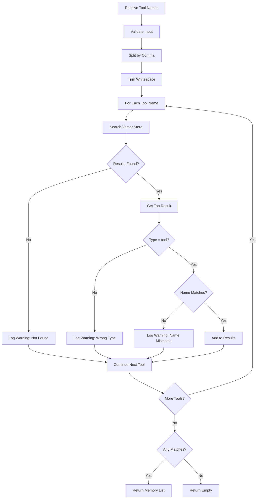
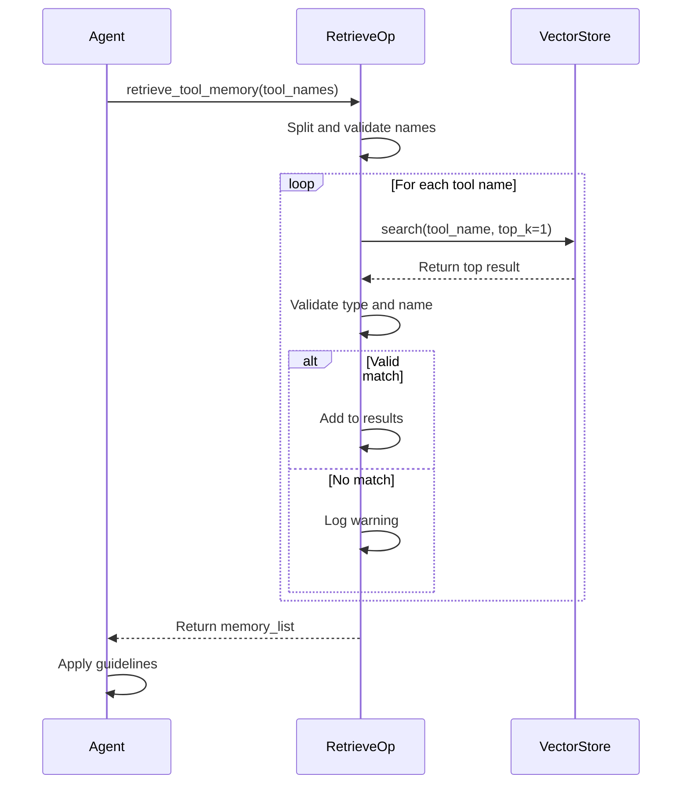

# Tool Memory Retrieval Operations

## RetrieveToolMemoryOp

### Purpose

Retrieves tool memories from the vector database based on tool names, providing usage patterns, best practices, and historical call data.

### Functionality

- Accepts comma-separated tool names as input
- Searches the vector store for exact tool name matches
- Validates that retrieved memories are of type "tool"
- Returns complete tool memories including usage guidelines and call history
- Provides detailed logging for debugging and monitoring

### Processing Flow



1. **Input Validation**:
   - Check if `tool_names` parameter is provided
   - Return error if empty
   - Log workspace_id and tool count

2. **Tool Name Processing**:
   - Split input by comma delimiter
   - Strip whitespace from each tool name
   - Filter out empty strings
   - Log the list of tools to retrieve

3. **Vector Store Search**:
   - For each tool name, search with `top_k=1`
   - Use tool name as the query (exact match preferred)
   - Retrieve the top matching result

4. **Result Validation**:
   - Verify result is of type `ToolMemory`
   - Check that `when_to_use` field exactly matches tool name
   - Log match details (memory_id, total_calls)
   - Warn if no match or mismatch found

5. **Response Preparation**:
   - Collect all matched tool memories
   - Set success status based on matches found
   - Return memory list in metadata

### Parameters

This operation has no configurable parameters. It uses the default vector store configuration.

### Input Schema

```yaml
input_schema:
  tool_names:
    type: string
    description: "Comma-separated tool names (e.g., 'tool_name1,tool_name2')"
    required: true
```

### Output Format

The operation sets the following in `context.response`:

```python
{
    "success": True,
    "answer": "Successfully retrieved 2 tool memories",
    "metadata": {
        "memory_list": [
            {
                "workspace_id": "demo_workspace",
                "memory_id": "abc123def456",
                "memory_type": "tool",
                "when_to_use": "web_search",
                "content": "Core Function: The web_search tool retrieves...",
                "score": 0.85,
                "time_created": "2025-10-15 10:00:00",
                "time_modified": "2025-10-15 14:30:00",
                "author": "qwen3-30b-a3b-instruct-2507",
                "tool_call_results": [
                    {
                        "create_time": "2025-10-15 14:30:00",
                        "tool_name": "web_search",
                        "input": {...},
                        "output": "...",
                        "summary": "...",
                        "evaluation": "...",
                        "score": 1.0,
                        "success": True,
                        "time_cost": 2.3,
                        "token_cost": 150
                    }
                ],
                "metadata": {}
            }
        ]
    }
}
```

### Usage Example

#### Basic Retrieval

```python
import requests

BASE_URL = "http://0.0.0.0:8002/"
WORKSPACE_ID = "demo_workspace"

# Retrieve memory for a single tool
response = requests.post(
    url=f"{BASE_URL}retrieve_tool_memory",
    json={
        "workspace_id": WORKSPACE_ID,
        "tool_names": "web_search"
    }
)

result = response.json()
if result.get("success"):
    memory_list = result.get("metadata", {}).get("memory_list", [])
    for memory in memory_list:
        print(f"Tool: {memory['when_to_use']}")
        print(f"Guidelines:\n{memory['content']}")
        print(f"Total Calls: {len(memory['tool_call_results'])}")
```

#### Multiple Tools Retrieval

```python
# Retrieve memories for multiple tools at once
response = requests.post(
    url=f"{BASE_URL}retrieve_tool_memory",
    json={
        "workspace_id": WORKSPACE_ID,
        "tool_names": "web_search,file_reader,api_caller,database_query"
    }
)

result = response.json()
if result.get("success"):
    memory_list = result.get("metadata", {}).get("memory_list", [])
    print(f"Retrieved {len(memory_list)} tool memories")
    
    for memory in memory_list:
        print(f"\n{'='*60}")
        print(f"Tool: {memory['when_to_use']}")
        print(f"{'='*60}")
        print(memory['content'])
```

#### Extracting Specific Information

```python
def get_tool_statistics(tool_name):
    """Get statistical information for a specific tool"""
    response = requests.post(
        url=f"{BASE_URL}retrieve_tool_memory",
        json={
            "workspace_id": WORKSPACE_ID,
            "tool_names": tool_name
        }
    )
    
    result = response.json()
    if not result.get("success"):
        return None
    
    memory_list = result.get("metadata", {}).get("memory_list", [])
    if not memory_list:
        return None
    
    memory = memory_list[0]
    tool_calls = memory['tool_call_results']
    
    # Calculate statistics
    total_calls = len(tool_calls)
    successful_calls = sum(1 for call in tool_calls if call['success'])
    avg_score = sum(call['score'] for call in tool_calls) / total_calls if total_calls > 0 else 0
    avg_time = sum(call['time_cost'] for call in tool_calls) / total_calls if total_calls > 0 else 0
    avg_tokens = sum(call['token_cost'] for call in tool_calls) / total_calls if total_calls > 0 else 0
    
    return {
        "tool_name": tool_name,
        "total_calls": total_calls,
        "success_rate": successful_calls / total_calls if total_calls > 0 else 0,
        "avg_score": avg_score,
        "avg_time_cost": avg_time,
        "avg_token_cost": avg_tokens,
        "guidelines": memory['content']
    }

# Usage
stats = get_tool_statistics("web_search")
if stats:
    print(f"Tool: {stats['tool_name']}")
    print(f"Total Calls: {stats['total_calls']}")
    print(f"Success Rate: {stats['success_rate']:.1%}")
    print(f"Avg Score: {stats['avg_score']:.2f}")
    print(f"Avg Time: {stats['avg_time_cost']:.2f}s")
    print(f"Avg Tokens: {stats['avg_token_cost']:.0f}")
```

### Integration with Agent Workflows

#### Pre-Execution Retrieval

```python
def execute_tool_with_guidelines(tool_name, input_params):
    """Execute a tool after retrieving its usage guidelines"""
    
    # 1. Retrieve tool memory
    response = requests.post(
        url=f"{BASE_URL}retrieve_tool_memory",
        json={
            "workspace_id": WORKSPACE_ID,
            "tool_names": tool_name
        }
    )
    
    # 2. Extract guidelines
    guidelines = ""
    if response.json().get("success"):
        memory_list = response.json().get("metadata", {}).get("memory_list", [])
        if memory_list:
            guidelines = memory_list[0]['content']
            print(f"Guidelines for {tool_name}:")
            print(guidelines)
    
    # 3. Adjust parameters based on guidelines
    # (This would be done by an LLM or rule-based system)
    adjusted_params = adjust_parameters(input_params, guidelines)
    
    # 4. Execute tool
    result = execute_tool(tool_name, adjusted_params)
    
    # 5. Record result
    record_tool_call(tool_name, adjusted_params, result)
    
    return result
```

#### Batch Retrieval for Agent Initialization

```python
def initialize_agent_with_tool_memories(available_tools):
    """Load all tool memories at agent initialization"""
    
    # Retrieve all tool memories at once
    tool_names = ",".join(available_tools)
    response = requests.post(
        url=f"{BASE_URL}retrieve_tool_memory",
        json={
            "workspace_id": WORKSPACE_ID,
            "tool_names": tool_names
        }
    )
    
    # Build tool memory cache
    tool_memory_cache = {}
    if response.json().get("success"):
        memory_list = response.json().get("metadata", {}).get("memory_list", [])
        for memory in memory_list:
            tool_memory_cache[memory['when_to_use']] = {
                "guidelines": memory['content'],
                "total_calls": len(memory['tool_call_results']),
                "last_modified": memory['time_modified']
            }
    
    return tool_memory_cache

# Usage
available_tools = ["web_search", "file_reader", "api_caller"]
tool_cache = initialize_agent_with_tool_memories(available_tools)

# Agent can now quickly access guidelines
if "web_search" in tool_cache:
    print(tool_cache["web_search"]["guidelines"])
```

### Error Handling

#### Tool Not Found

```python
response = requests.post(
    url=f"{BASE_URL}retrieve_tool_memory",
    json={
        "workspace_id": WORKSPACE_ID,
        "tool_names": "nonexistent_tool"
    }
)

result = response.json()
if not result.get("success"):
    print(f"Error: {result.get('answer')}")
    # Output: "No matching tool memories found"
```

#### Empty Tool Names

```python
response = requests.post(
    url=f"{BASE_URL}retrieve_tool_memory",
    json={
        "workspace_id": WORKSPACE_ID,
        "tool_names": ""
    }
)

result = response.json()
if not result.get("success"):
    print(f"Error: {result.get('answer')}")
    # Output: "tool_names is required"
```

#### Partial Matches

```python
# Request 3 tools, but only 2 exist
response = requests.post(
    url=f"{BASE_URL}retrieve_tool_memory",
    json={
        "workspace_id": WORKSPACE_ID,
        "tool_names": "web_search,file_reader,nonexistent_tool"
    }
)

result = response.json()
if result.get("success"):
    memory_list = result.get("metadata", {}).get("memory_list", [])
    print(f"Found {len(memory_list)} out of 3 requested tools")
    # Output: "Found 2 out of 3 requested tools"
```

### Retrieval Workflow



### Use Cases

#### Use Case 1: Pre-Execution Guidance

**Scenario**: Before executing a tool, the agent retrieves usage guidelines to optimize parameters.

```python
# Agent needs to search the web
tool_name = "web_search"
query = "machine learning basics"

# Retrieve guidelines
response = requests.post(
    url=f"{BASE_URL}retrieve_tool_memory",
    json={
        "workspace_id": WORKSPACE_ID,
        "tool_names": tool_name
    }
)

# Guidelines suggest: max_results=10-20, use filter_type="technical_docs"
# Agent adjusts parameters accordingly
optimized_params = {
    "query": query,
    "max_results": 15,  # Within recommended range
    "filter_type": "technical_docs",  # As suggested
    "language": "en"
}

# Execute with optimized parameters
result = execute_tool(tool_name, optimized_params)
```

#### Use Case 2: Performance Monitoring

**Scenario**: Monitor tool performance trends over time.

```python
def monitor_tool_performance(tool_name):
    """Monitor tool performance and detect degradation"""
    response = requests.post(
        url=f"{BASE_URL}retrieve_tool_memory",
        json={
            "workspace_id": WORKSPACE_ID,
            "tool_names": tool_name
        }
    )
    
    if not response.json().get("success"):
        return None
    
    memory = response.json()["metadata"]["memory_list"][0]
    calls = memory["tool_call_results"]
    
    # Analyze recent vs historical performance
    recent_calls = calls[-20:]  # Last 20 calls
    historical_calls = calls[:-20] if len(calls) > 20 else []
    
    recent_success_rate = sum(1 for c in recent_calls if c['success']) / len(recent_calls)
    historical_success_rate = (sum(1 for c in historical_calls if c['success']) / len(historical_calls) 
                               if historical_calls else recent_success_rate)
    
    # Detect degradation
    if recent_success_rate < historical_success_rate - 0.1:
        print(f"Warning: {tool_name} performance degraded!")
        print(f"Recent: {recent_success_rate:.1%}, Historical: {historical_success_rate:.1%}")
        return "degraded"
    
    return "healthy"

# Usage
status = monitor_tool_performance("web_search")
```

#### Use Case 3: Tool Selection

**Scenario**: Choose the best tool for a task based on historical performance.

```python
def select_best_tool(task_description, candidate_tools):
    """Select the best tool based on historical performance"""
    
    # Retrieve memories for all candidate tools
    tool_names = ",".join(candidate_tools)
    response = requests.post(
        url=f"{BASE_URL}retrieve_tool_memory",
        json={
            "workspace_id": WORKSPACE_ID,
            "tool_names": tool_names
        }
    )
    
    if not response.json().get("success"):
        return candidate_tools[0]  # Default to first
    
    memory_list = response.json()["metadata"]["memory_list"]
    
    # Score each tool
    tool_scores = {}
    for memory in memory_list:
        calls = memory["tool_call_results"]
        if not calls:
            continue
        
        # Calculate composite score
        success_rate = sum(1 for c in calls if c['success']) / len(calls)
        avg_score = sum(c['score'] for c in calls) / len(calls)
        avg_time = sum(c['time_cost'] for c in calls) / len(calls)
        
        # Composite: prioritize success and quality, penalize slow tools
        composite = (success_rate * 0.4 + avg_score * 0.4 + (1 / (1 + avg_time)) * 0.2)
        tool_scores[memory['when_to_use']] = composite
    
    # Select best tool
    if tool_scores:
        best_tool = max(tool_scores, key=tool_scores.get)
        print(f"Selected {best_tool} with score {tool_scores[best_tool]:.2f}")
        return best_tool
    
    return candidate_tools[0]

# Usage
best = select_best_tool(
    "Search for technical documentation",
    ["web_search", "doc_search", "api_search"]
)
```

## Best Practices

1. **Retrieval Timing**:
   - Retrieve guidelines before first use of a tool
   - Cache retrieved memories for the duration of a task
   - Re-retrieve after tool memory updates (post-summarization)

2. **Batch Retrieval**:
   - Retrieve multiple tool memories in a single request
   - Use comma-separated tool names for efficiency
   - Initialize agent with all available tool memories

3. **Error Handling**:
   - Always check `success` status in response
   - Handle cases where tool memory doesn't exist
   - Provide fallback behavior for missing guidelines

4. **Guidelines Application**:
   - Parse guidelines to extract parameter recommendations
   - Use LLM to interpret guidelines in context
   - Combine guidelines with task-specific requirements

5. **Performance Optimization**:
   - Cache retrieved memories to avoid repeated calls
   - Invalidate cache after summarization updates
   - Monitor retrieval latency and optimize if needed

6. **Monitoring**:
   - Log retrieval requests for debugging
   - Track which tools are frequently retrieved
   - Identify tools without memory (candidates for recording)

