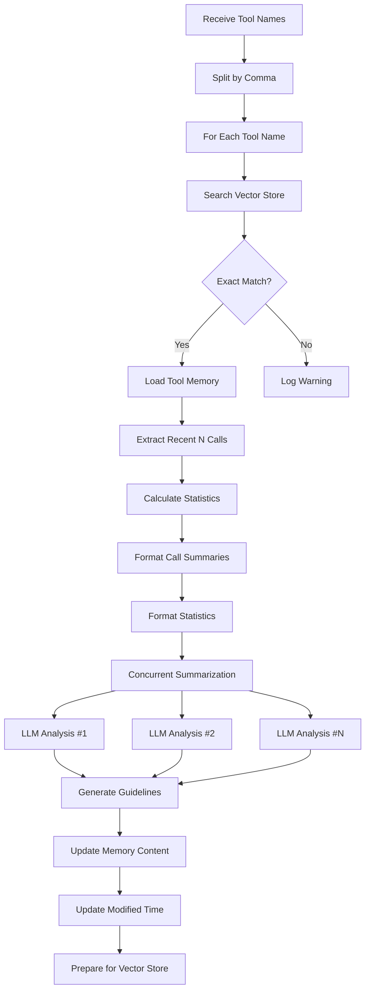

# Tool Summary Operations

## ParseToolCallResultOp

### Purpose

Evaluates individual tool invocations and adds them to the tool memory database with comprehensive assessments.

### Functionality

- Receives tool call results with input parameters, output, and metadata
- Uses LLM to evaluate each tool call based on success and parameter alignment
- Generates summary, evaluation, and score (0.0, 0.5, or 1.0) for each call
- Appends evaluated results to existing tool memory or creates new memory
- Maintains a sliding window of recent tool calls (configurable limit)

### Processing Flow


1. **Input Validation**:
   - Verify `tool_name` is provided
   - Convert dict objects to `ToolCallResult` instances
   - Check if `tool_call_results` list is not empty

2. **Memory Lookup**:
   - Search vector store for existing tool memory by tool name
   - Verify exact match (memory type = "tool" and when_to_use = tool_name)
   - Create new `ToolMemory` if no match found

3. **Concurrent Evaluation**:
   - Submit all tool call results for parallel evaluation
   - Each evaluation uses LLM to analyze the call
   - Generate structured evaluation with summary, assessment, and score

4. **Memory Update**:
   - Append evaluated results to tool memory
   - Trim to `max_history_tool_call_cnt` if limit exceeded
   - Update modification timestamp
   - Prepare for vector store update

### Parameters

Configure in `default.yaml`:

```yaml
op:
  parse_tool_call_result_op:
    backend: parse_tool_call_result_op
    llm: default
    params:
      max_history_tool_call_cnt: 100
      evaluation_sleep_interval: 1.0
```

- `max_history_tool_call_cnt` (integer, default: `100`):
  - Maximum number of historical tool call results to retain per tool
  - When exceeded, oldest results are removed (FIFO)
  - Balances memory size with historical context
  - Recommended: 50-200 depending on tool usage frequency

- `evaluation_sleep_interval` (float, default: `1.0`):
  - Delay in seconds between concurrent evaluations
  - Prevents rate limiting when evaluating multiple calls
  - Set to 0 for maximum speed (if no rate limits)
  - Increase if encountering API throttling

### Evaluation Criteria

The LLM evaluates each tool call based on two dimensions:

1. **Success Evaluation**:
   - Check if the success flag indicates successful execution
   - Verify output contains no error messages
   - Assess if time and token costs are reasonable
   - Identify any error indicators in the output

2. **Parameter Alignment Evaluation**:
   - Evaluate if output matches expected behavior given input
   - Consider if input parameters are appropriate for the tool
   - Check for parameter mismatches or unexpected behaviors
   - Verify output is consistent with tool's intended purpose

### Scoring Guidelines

- **1.0 (Success)**: Tool executed successfully with good parameter alignment
  - Example: Query returned relevant results, parameters were appropriate
  
- **0.5 (Partial Success)**: Tool executed but with issues
  - Example: Query succeeded but parameters were suboptimal (e.g., too generic)
  - Example: Results returned but with warnings about invalid parameters
  
- **0.0 (Failure)**: Tool execution failed or severe parameter misalignment
  - Example: Timeout due to excessive max_results parameter
  - Example: Error due to invalid parameter format

### Output Format

The operation sets the following in `context.response.metadata`:

```python
{
    "deleted_memory_ids": ["memory_id_if_updating"],
    "memory_list": [
        {
            "memory_id": "abc123",
            "when_to_use": "web_search",
            "tool_call_results": [
                {
                    "create_time": "2025-10-15 14:30:00",
                    "tool_name": "web_search",
                    "input": {...},
                    "output": "...",
                    "summary": "Successfully retrieved 10 relevant results",
                    "evaluation": "Good parameter alignment...",
                    "score": 1.0,
                    "success": True,
                    "time_cost": 2.3,
                    "token_cost": 150
                }
            ]
        }
    ]
}
```

### Usage Example

```python
import requests
from datetime import datetime

BASE_URL = "http://0.0.0.0:8002/"
WORKSPACE_ID = "demo_workspace"

# Prepare tool call results
tool_call_results = [
    {
        "create_time": datetime.now().strftime("%Y-%m-%d %H:%M:%S"),
        "tool_name": "web_search",
        "input": {
            "query": "Python asyncio tutorial",
            "max_results": 10,
            "language": "en",
            "filter_type": "technical_docs"
        },
        "output": "Found 10 relevant results including official documentation and tutorials",
        "token_cost": 150,
        "success": True,
        "time_cost": 2.3
    },
    {
        "create_time": datetime.now().strftime("%Y-%m-%d %H:%M:%S"),
        "tool_name": "web_search",
        "input": {
            "query": "test",  # Too generic
            "max_results": 100,  # Too many
            "language": "unknown"  # Invalid
        },
        "output": "Warning: language 'unknown' not supported. Query too generic, limited results.",
        "token_cost": 80,
        "success": True,
        "time_cost": 3.5
    }
]

# Add tool call results
response = requests.post(
    url=f"{BASE_URL}add_tool_call_result",
    json={
        "workspace_id": WORKSPACE_ID,
        "tool_name": "web_search",
        "tool_call_results": tool_call_results
    }
)

result = response.json()
print(f"Success: {result.get('success')}")
print(f"Answer: {result.get('answer')}")

# Check evaluated results
memory_list = result.get("metadata", {}).get("memory_list", [])
if memory_list:
    tool_memory = memory_list[0]
    for call_result in tool_memory["tool_call_results"]:
        print(f"\nCall Summary: {call_result['summary']}")
        print(f"Evaluation: {call_result['evaluation']}")
        print(f"Score: {call_result['score']}")
```

## SummaryToolMemoryOp

### Purpose

Analyzes accumulated tool call history and generates comprehensive usage patterns, best practices, and recommendations.

### Functionality

- Retrieves existing tool memories from the vector store
- Analyzes the most recent N tool calls (configurable)
- Calculates statistical metrics (success rate, average scores, costs)
- Uses LLM to synthesize actionable usage guidelines
- Updates tool memory content with generated insights

### Processing Flow



1. **Tool Name Processing**:
   - Split comma-separated tool names
   - Trim whitespace from each name
   - Log the list of tools to process

2. **Memory Retrieval**:
   - Search vector store for each tool name
   - Verify exact match (memory type and when_to_use)
   - Skip tools without existing memory

3. **Data Preparation**:
   - Extract the most recent N tool call results
   - Calculate statistical metrics:
     - Total calls vs recent calls analyzed
     - Success rate (overall and recent)
     - Average score (overall and recent)
     - Average time cost
     - Average token cost
   - Format call summaries as markdown
   - Format statistics as markdown

4. **Concurrent Summarization**:
   - Submit all tools for parallel summarization
   - Each summarization uses LLM to analyze patterns
   - Generate structured usage guidelines

5. **Memory Update**:
   - Update tool memory content with new guidelines
   - Update modification timestamp
   - Prepare for vector store update

### Parameters

Configure in `default.yaml`:

```yaml
op:
  summary_tool_memory_op:
    backend: summary_tool_memory_op
    llm: default
    params:
      recent_call_count: 20
      summary_sleep_interval: 1.0
```

- `recent_call_count` (integer, default: `20`):
  - Number of most recent tool calls to analyze
  - Focuses on recent usage patterns
  - Recommended: 10-50 depending on tool usage frequency
  - Higher values provide more context but may dilute recent patterns

- `summary_sleep_interval` (float, default: `1.0`):
  - Delay in seconds between concurrent summarizations
  - Prevents rate limiting when summarizing multiple tools
  - Set to 0 for maximum speed (if no rate limits)
  - Increase if encountering API throttling

### Statistical Metrics

The operation calculates the following metrics:

```python
{
    "total_calls": 100,              # Total number of calls in history
    "recent_calls": 20,              # Number of recent calls analyzed
    "success_rate": 0.85,            # Overall success rate (85%)
    "recent_success_rate": 0.90,     # Recent success rate (90%)
    "avg_score": 0.78,               # Average evaluation score
    "recent_avg_score": 0.82,        # Recent average score
    "avg_time_cost": 2.45,           # Average time in seconds
    "avg_token_cost": 125.3          # Average token consumption
}
```

### Generated Guidelines Structure

The LLM generates guidelines following this structure:

1. **Core Function**: What the tool does and when to use it
2. **Success Patterns**: Parameter patterns and scenarios that work well
3. **Common Issues**: Main pitfalls to avoid and why they fail
4. **Best Practices**: 2-3 actionable recommendations

### Usage Example

```python
import requests

BASE_URL = "http://0.0.0.0:8002/"
WORKSPACE_ID = "demo_workspace"

# After accumulating tool call history, generate guidelines
response = requests.post(
    url=f"{BASE_URL}summary_tool_memory",
    json={
        "workspace_id": WORKSPACE_ID,
        "tool_names": "web_search,file_reader,api_caller"  # Multiple tools
    }
)

result = response.json()
print(f"Success: {result.get('success')}")
print(f"Answer: {result.get('answer')}")

# Display generated guidelines
memory_list = result.get("metadata", {}).get("memory_list", [])
for memory in memory_list:
    print(f"\n{'='*60}")
    print(f"Tool: {memory['when_to_use']}")
    print(f"{'='*60}")
    print(memory['content'])
    
    # Display statistics
    stats = memory.get('metadata', {}).get('statistics', {})
    print(f"\nStatistics:")
    print(f"  Total Calls: {stats.get('total_calls', 0)}")
    print(f"  Success Rate: {stats.get('success_rate', 0):.1%}")
    print(f"  Avg Score: {stats.get('avg_score', 0):.2f}")
```

### Example Generated Guidelines

```
Core Function:
The web_search tool retrieves information from the internet based on query parameters. 
Use it when you need up-to-date information, documentation, or external data.

Success Patterns:
- Specific queries (e.g., "Python asyncio tutorial") achieve 95% success rate
- Setting max_results=10-20 balances quality and performance
- Using language="en" and filter_type="technical_docs" improves relevance
- Average successful call: 2.3s, 150 tokens

Common Issues:
- Generic queries (e.g., "test") return poor results (score: 0.5)
- max_results > 50 often leads to timeouts (avg: 8.2s vs 2.3s)
- Invalid language codes default to English but add latency
- Missing filter_type returns mixed-quality results

Best Practices:
1. Use specific, descriptive queries with clear intent
2. Set max_results=10-20 for optimal balance
3. Always specify language and filter_type for technical searches
```

### When to Run Summarization

- **Initial Setup**: After accumulating 20-30 tool calls
- **Regular Updates**: Every 50-100 new calls
- **Pattern Changes**: When success rate changes significantly
- **Tool Updates**: After tool version changes or parameter updates
- **Performance Issues**: When investigating declining performance

### Integration with Retrieval


The summarization operation works in conjunction with retrieval:
1. `add_tool_call_result` continuously records invocations
2. `summary_tool_memory` periodically generates guidelines
3. `retrieve_tool_memory` provides guidelines before tool use
4. Agent applies recommendations to improve success rates

## Best Practices

1. **Recording Strategy**:
   - Record every tool invocation, including failures
   - Include detailed input parameters and complete output
   - Capture accurate performance metrics
   - Add relevant metadata for context

2. **Evaluation Quality**:
   - Ensure LLM has sufficient context for evaluation
   - Monitor score distribution (should not be all 1.0 or 0.0)
   - Review evaluations periodically for quality
   - Adjust evaluation prompts if needed

3. **Summarization Timing**:
   - Wait for 20-30 calls before first summarization
   - Re-summarize after significant new data (50+ calls)
   - Update when usage patterns change
   - Regenerate after tool updates

4. **Parameter Tuning**:
   - Adjust `max_history_tool_call_cnt` based on tool usage frequency
   - Increase `recent_call_count` for tools with diverse patterns
   - Balance `sleep_interval` between speed and rate limits
   - Monitor vector store size and adjust retention limits

5. **Quality Maintenance**:
   - Review generated guidelines for accuracy
   - Validate statistical metrics match expectations
   - Clean up deprecated tools from vector store
   - Archive historical data before major changes

